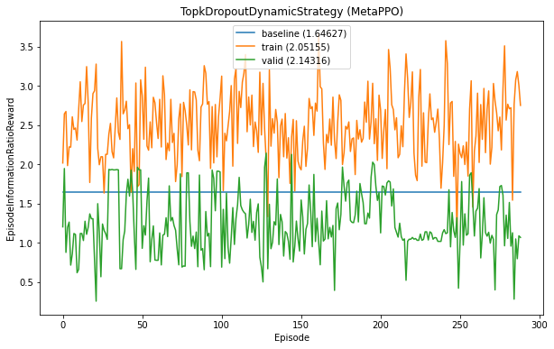

# Long-Capital: Quant Trading with Qlib

## Performance
|Method| Signal Model | Trading Strategy | IR |
| :--- | :------- |:------- | :-----------: |
| [Supervised Learning](examples/sl.ipynb) | LGBM | TopkDropoutStrategy | 1.644155 |
| [Reinforcement Learning](examples/rl.ipynb)| LGBM | TopkDropoutDynamicStrategy | **2.143160**|

## Learning Curve

## Dependency
- My fork of [Qlib](https://github.com/microsoft/qlib): https://github.com/ChenglongChen/qlib
- You can get crowd source data from [investment_data](https://github.com/chenditc/investment_data)
